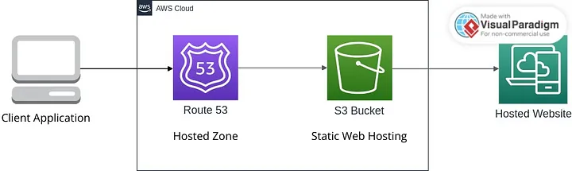

# Static Website Hosting using Route 53 and S3

----

## Overview

This project demonstrates the process of hosting a static website using Amazon S3 and Route 53. By following the steps outlined below, you can set up a simple static website and configure Route 53 to route traffic from a registered domain to the S3 bucket hosting the website.

## Project Details

- **Domain Name**: `coreyprojects.com`
- **S3 Bucket Name**: `coreyprojects.com`
- **Bucket Policy**: Enabled to allow public access to objects in the bucket
- **Static Website Hosting**: Enabled in the S3 bucket properties
- **Alias Record**: Created in Route 53 hosted zones to route traffic from the S3 bucket URL to the domain name `coreyprojects.com`

## Architecture

The architecture of the project involves the following components:

- **Amazon S3 Bucket**: Used to store the static website files, including HTML, CSS, JavaScript, and media assets.
- **Route 53**: Used for domain registration and DNS routing. An alias record is created to direct traffic from the registered domain to the S3 bucket.

## Setup Steps

1. **Register Domain**: Register a domain name through Route 53 or any other domain registrar of your choice. In this project, the domain name used is `coreyprojects.com`.

2. **Create S3 Bucket**: Create an S3 bucket with the same name as your domain (`coreyprojects.com`). Upload your website files (HTML, CSS, JavaScript, etc.) to this bucket.

3. **Enable Static Website Hosting**: In the S3 bucket properties, enable static website hosting and specify the index document (e.g., `index.html`).

4. **Configure Bucket Policy**: Create a bucket policy to allow public access to the objects in the bucket. This ensures that users can view the website content.

5. **Create Alias Record**: In Route 53, create an alias record in your hosted zone to route traffic from the S3 bucket URL (e.g., `coreyprojects.com.s3-website-us-east-1.amazonaws.com`) to your registered domain name (`coreyprojects.com`).

## Deployment Process

1. Upload your website files to the S3 bucket.
2. Enable static website hosting in the S3 bucket properties.
3. Configure a bucket policy to allow public access to objects.
4. Create an alias record in Route 53 to route traffic to the S3 bucket URL.
5. Verify the setup by accessing the website using the registered domain name (`coreyprojects.com`).

## Summary

Hosting a static website using Amazon S3 and Route 53 is a straightforward process that provides a reliable and scalable solution for serving web content. By following the steps outlined in this README, you can easily set up and deploy your static website on AWS.
